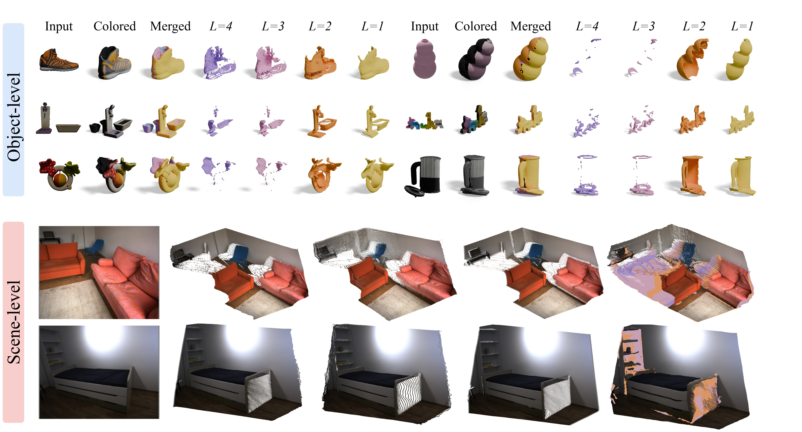

<div align="center">
<h2><span class="lari_name">LaRI</span>: Layered Ray Intersections for Single-view 3D Geometric Reasoning</h2>

[**Rui Li**](https://ruili3.github.io/)<sup>1</sup> · [**Biao Zhang**](https://1zb.github.io/)<sup>1</sup> · [**Zhenyu Li**](https://zhyever.github.io/)<sup>1</sup> · [**Federico Tombari**](https://federicotombari.github.io/)<sup>2,3</sup> · [**Peter Wonka**](https://peterwonka.net/)<sup>2,3</sup>  

<sup>1</sup>KAUST · <sup>2</sup>Google · <sup>3</sup>Technical University of Munich

**arXiv 2025**

<a href="https://arxiv.org/abs/2504.18424"></a>
<a href='https://ruili3.github.io/lari/index.html'></a>
<a href='https://huggingface.co/spaces/ruili3/LaRI'></a>
</div>

> **LaRI** is a **single-feed-forward** method that models **unseen 3D geometry** using layered point maps. It enables complete, efficient, and view-aligned geometric reasoning from a single image.


<p align="center">
  
</p>


### 📋 TODO List
- [x] Inference code & Gradio demo
- [ ] Object- and Scene-level evaluation data & code (ETA: Early May)
- [ ] Training data & code (ETA: Early May)


### 🛠️ Environment Setup
```bash
conda create -n lari python=3.10 -y
conda activate lari
pip install -r requirements.txt
```

### 🚀 Quick Start
We currently provide the object-level model at our HuggingaFace [Model Hub](https://huggingface.co/ruili3/LaRI/tree/main). Try out the examples or your own images via the methods below:
#### 🔹 Gradio Demo

Launch the Gradio interface locally:

```bash
python app.py
```

Or try it online via [HuggingFace Demo](https://huggingface.co/spaces/ruili3/LaRI).

#### 🔹 Command Line

Run object-level modeling with:

```bash
python demo.py --image_path assets/cole_hardware.png
```

> The input image path is specified via `--image_path`. Set `--is_remove_background` to remove the background. Layered depth maps and the 3D model will be saved in the `./results` directory by default.


### 📰 Citation
Please cite our paper if you use the code in this repository:
```
@inproceedings{li2025lari,
      title={LaRI: Layered Ray Intersections for Single-view 3D Geometric Reasoning}, 
      author={Li, Rui and Zhang, Biao and Li, Zhenyu and Tombari, Federico and Wonka, Peter},
      booktitle={arXiv preprint arXiv:2504.18424},
      year={2025}
}
```